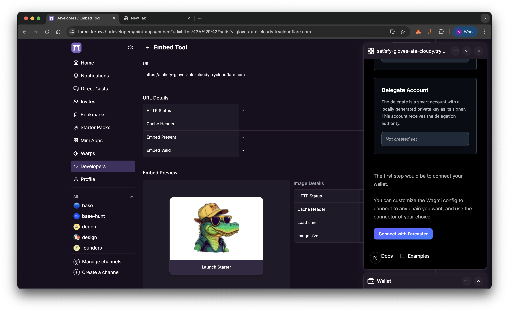

# MetaMask Smart Accounts x Farcaster starter template

This is a NextJS MetaMask Smart Accounts x Farcaster starter template created with `@metamask/create-gator-app`.

This template helps you quickly bootstrap your project with a Farcaster mini app and MetaMask Smart Accounts. It 
provides a foundation for building mini apps that leverage account abstraction and powerful delegation features to 
deliver seamless, secure, and flexible user experiences.

Learn more about [Metamask Smart Accounts](https://docs.metamask.io/delegation-toolkit/concepts/smart-accounts/).

## Prerequisites

1. **Pimlico API Key**: In this template, you’ll use Pimlico’s bundler and paymaster
services to submit user operations and sponsor transactions. You can get 
your API key from [Pimlico’s dashboard](https://dashboard.pimlico.io/apikeys).


## Project structure

```bash
template/
├── public/ # Static assets
├── src/
│ ├── app/ # App router pages
│ ├── components/ # UI Components
│ ├── hooks/ # Custom React hooks
│ ├── providers/ # Custom React Context Provider
│ └── utils/ # Utils for the starter
├── .env # Environment variables
├── .gitignore # Git ignore rules
├── next.config.ts # Next.js configuration
└── tsconfig.json # TypeScript configuration
```

## Setup environment variables

Update the following environment variables in the `.env` file at the root of your project.

```
NEXT_PUBLIC_PIMLICO_API_KEY =
```

## Getting started

First, start the development server using the package manager you chose during setup.

```bash
npm run dev
# or
yarn dev
# or
pnpm dev
```

Open [http://localhost:3000](http://localhost:3000) in your browser to view the app.

## View with Farcaster Embed tool

Farcaster offers a handy [Embed tool](https://farcaster.xyz/~/developers/mini-apps/embed) that lets you preview and inspect your Mini App before publishing it. This tool 
works only with hosted URLs. To make your local project accessible remotely, you can create a tunnel using tools like 
ngrok or cloudflared. 

In this guide, we’re using cloudflared, but you’re free to choose whichever tool you prefer.

### Create a tunnel

```bash
cloudflared tunnel --url http://localhost:3000
```

### Update environment variable

```
NEXT_PUBLIC_URL = "CLOUDFLARED_URL"
```

### Test the mini app

Once you have the remote url, you can view the app in [embed tool](https://farcaster.xyz/~/developers/mini-apps/embed) by entering the url.




## Learn more

To learn more about MetaMask Smart Accounts, take a look at the following resources:

- [Quickstart](https://docs.metamask.io/delegation-toolkit/get-started/quickstart/) - Get started quickly with the MetaMask Smart Accounts
- [Delegation quickstart](https://docs.metamask.io/delegation-toolkit/get-started/delegation-quickstart/) - Get started quickly with creating a MetaMask smart account and completing the delegation lifecycle (creating, signing, and redeeming a delegation).